[GinAmore Live Link](https://ginamore.herokuapp.com/)
[GitHub Repository](https://github.com/sophiebatten123/GinAmore)

# GinAmore

(Developer: Sophie Batten)

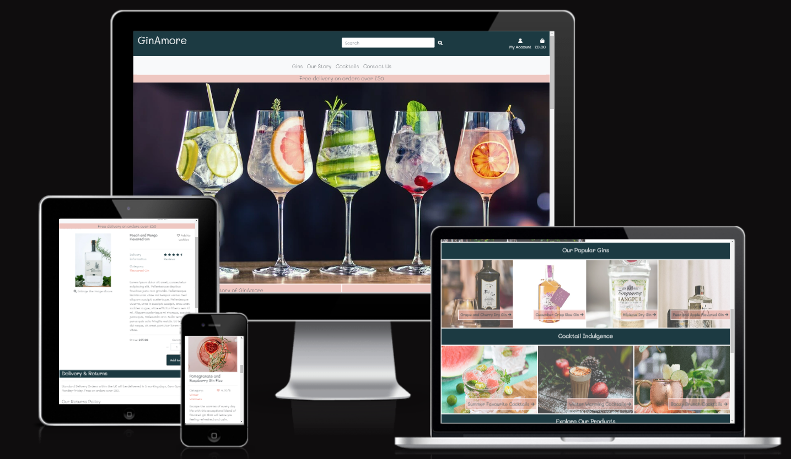

GinAmore is an ecommerce website built using Django, Python, HTML, CSS and JavaScript as part of the Code Institute Diploma in Full Stack Software Development.

## Aim
GinAmore aims to provide users with the ability to easily purchase premium flavoured gin. It does this by providing clear and concise site navigation and checkout functionality throughout the site. GinAmore encourages users to make informed purchases allowing them to favourite items and revisit them later inside their personalised wish list. Users are given cocktail ideas that compliment with the sites products, encouraging them to make purchases and revisit the site more regularly. Moreover, GinAmore prides itself on transparency allowing users to write reviews on products, increasing trust between the company and its clients.

# Table of Contents:

- [UX](#)
  - [User Stories](#)
  - [Agile Planning Environment](agile-planning-environment)
  - [Design](#)
    - [GinAmore Design Principles](#)
    - [Colour Scheme](#colour-scheme)
    - [Typography](#typography)
    - [Imagery](#imagery)
  - [Wireframes](wireframes)
    - [Desktop Wireframes](desktop-wireframes)
    - [Mobile Wireframes](mobile-wireframes)
  - [Features](#)
  - [Future Features](#)
  - [Functionality](#)
    - [Fixed Bugs and Errors](#)
    - [Technologies Used](#)
    - [Programs Used](#)
  - [Data Schema](#)
    - [Logic Flowchart](#)
    - [Entity Relationship Diagram](#)
- [Testing](#)
    - [Manual Testing](#)
    - [Automated Testing](#)
- [Future Features](#)
- [Deployment](#)
- [Credits](#)

## User Stories

### EPIC: Viewing and Navigation (Products)

| ID | As A |I want to be able to...|So that I can...|Story Points|MoSCoW|
|----|------|-----------------------|----------------|------------|------|
|1| Shopper | View a list of all Gin products | Select which ones I want to purchase | 8 | Mo |
|2| Shopper | View individual Gin details | Identify the price, description and product rating of each product | 5 | Mo |
|3| Shopper | Identify any deals and special offers quickly on the page | Take advantage of special offers | 1 | Mo |

### EPIC: Registration and Verification

| ID | As A |I want to be able to...|So that I can...|Story Points|MoSCoW|
|----|------|-----------------------|----------------|------------|------|
|4| Site User | Easily register for an account | View my personal profile information | 3 | Mo |
|5| Site User | Easily login/logout of my account | Access my personal account | 3 | Mo |
|6| Site User | Easily recover my password if I forget it | Recover access to my account | 2 | Mo |
|7| Site User | Receive an email to verify I have created an account | Verify my account is set up. | 2 | S |
|8| Site User | Register/login to an account via social media | Login to my account quicker | 5 | Co |
|9| Site User | Confirm I am of legal age to drink | Use the site effectively and purchase items | 3 | Mo |


### EPIC: Sorting and Searching

| ID | As A |I want to be able to...|So that I can...|Story Points|MoSCoW|
|----|------|-----------------------|----------------|------------|------|
|10| Shopper | Sort through all Gin products | Easily see the best rated, best priced items | 3 | Mo |
|11| Shopper | Sort based on the Gin category | Sort Gin items based on the type of Gin I prefer | 3 | Mo |
|12| Shopper | Search a product by name and description | Find a specific Gin I would like to purchase | 3 | Mo |
|13| Shopper |  See search results quickly and easily  | Quickly decide which product I would like to purchase | 2 | Mo |

### EPIC: Purchasing and Checkout

| ID | As A |I want to be able to...|So that I can...|Story Points|MoSCoW|
|----|------|-----------------------|----------------|------------|------|
|14| Shopper | View items in my bag to be purchased | Check total cost and the items that I will be purchasing | 2 | Mo |
|15| Shopper | Receive an email to verify my order | Feel more secure that my payment has gone through | 3 | S |
|16| Shopper | View an order confirmation when my order is complete | Check my order is correct without mistakes | 2 | S |
|17| Shopper | Securely provide payment details | Confidently provide payment details to purchase an item | 5 | Mo |
|18| Shopper | Enter payment information quickly  | Check out quickly without hassle | 3 | Mo |
|19| Shopper | Adjust the quantity of items in my bag | Easily adjust the quantity for my own preference | 2 | Mo |
|20| Shopper | Select the quantity of product to add to shopping bag | I am able to get the amount of Gin I require | 3 | Mo |
|21| Shopper | Quickly see the total cost of all my products | Avoid spending too much | 2 | Mo |

### EPIC: Admin and Store Management

| ID | As A |I want to be able to...|So that I can...|Story Points|MoSCoW|
|----|------|-----------------------|----------------|------------|------|
|22| Store Owner | Easily Add Cocktail Recipes | Keep recipes interesting and new to users | 5 | Co |
|23| Store Owner | Edit/Update Cocktail Recipes | Ensure the cocktail information is up to date | 3 | Co |
|24| Store Owner | Add a Product | Add new products to my store | 3 | Mo |
|25| Store Owner | Edit/Update a Product | Change details of a product including description and price | 3 | Mo |
|26| Store Owner | Delete a Product | Remove any discontinued products | 1 | Mo |

### EPIC: Product and Cocktail Reviews

| ID | As A |I want to be able to...|So that I can...|Story Points|MoSCoW|
|----|------|-----------------------|----------------|------------|------|
|27| Shopper | Rate and Review Cocktail Recipes | Communicate with others on the site | 5 | Co |
|28| Store Owner | Delete a Review |  Filter the content shown to customer | 1 | S |
|29| Shopper | Leave a Product Review | Advise other shoppers on their purchases | 3 | S |
|30| Shopper | Submit cocktail recipe ideas | Contribute to the site and feel in contact with other cocktail makers | 5 | W |

### EPIC: Wishlist Functionality

| ID | As A |I want to be able to...|So that I can...|Story Points|MoSCoW|
|----|------|-----------------------|----------------|------------|------|
|31| Shopper | Add items to my wish list | Easily find items later on to purchase them quickly | 3 | S |
|32| Shopper | Remove items from my wish list | Keep my wish list basket up to date with things I love | 1 | S |

### EPIC: Viewing and Navigation (Cocktails)

| ID | As A |I want to be able to...|So that I can...|Story Points|MoSCoW|
|----|------|-----------------------|----------------|------------|------|
|33| Shopper | View individual cocktail recipes | Learn how to make individual cocktails | 5 | S |
|34| Shopper | View cocktail recipes based on their category | Choose which recipe I would like to make | 2 | Co |

# Agile Planning Environment

The story point allocation above is based upon a 100 point iteration and uses the Fibonacci Sequence. Using the MoSCoW method each user story was then been labelled as being either 'Must Have', 'Should Have', 'Could Have' or 'Wont Have', based upon its importance to the project whilst following the 60:20:20 MoSCoW format. Note that the 'Wont Have' User Story below was excluded from the 60:20:20 MoSCoW allocation.

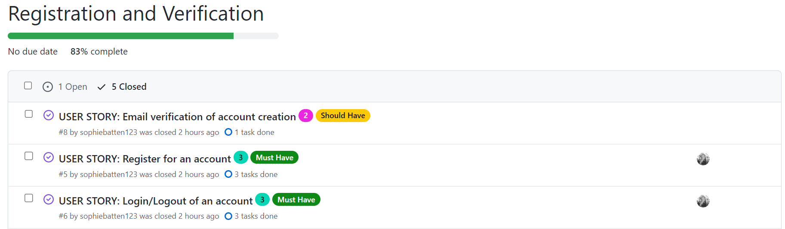

## Acceptance Criteria

Each of the user stories was given acceptance criteria, an example of this can be seen below:
 


This helped to ensure all tasks were completed before the user story was marked as done and ensured the website was fully functional. I also used the acceptance criteria to guide the manual testing that was performed throughout the project.

# Existing Features

***
## All Pages
***

### Navigation

The navigation bar features on all pages on the site this allows users to easily move through the site and find the products they wish to purchase or the cocktails they wish to make. 

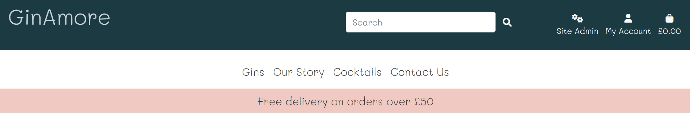

### Newsletter Sign Up

Users are encouraged to sign up to GinAmore's site, giving them access to featured products and discounts. This feature was set up using [Mailchimp](https://mailchimp.com/en-gb/), a marketing platform, that can be used to communicate with customers.

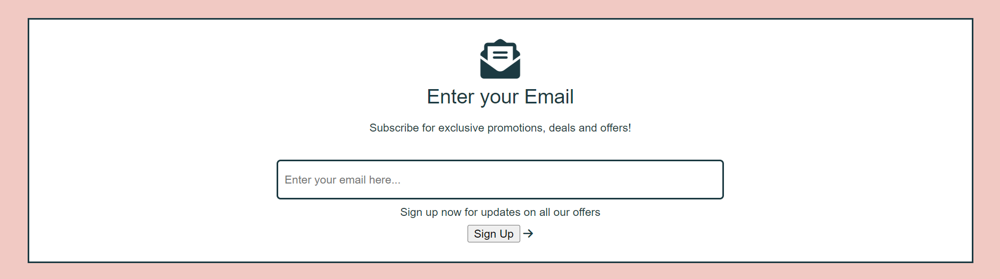

### Footer

The footer of the page provides users with informational resources that help to promote trust between the customer and GinAmore. Furthermore, all of the social network features link to GinAmore's personalised pages, encouraging customers to follow the company for discounts, deals and cocktail recipes.

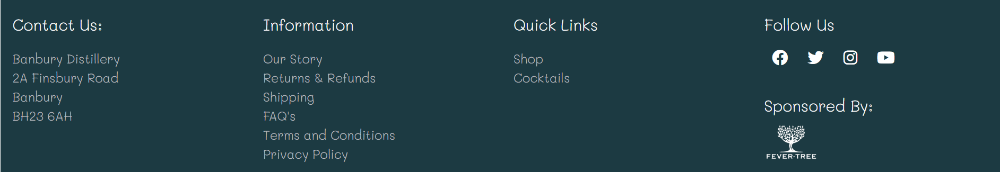

***
## Home Page
***

### Main Image

The main image on the site was carefully selected, with the aim to entice customers to explore the site further, thus improving the sites google metrics. The bold and contrasting colours within this image were then selected using [Chrome DevTools](https://developer.chrome.com/docs/devtools/) and applied within the rest of the site.

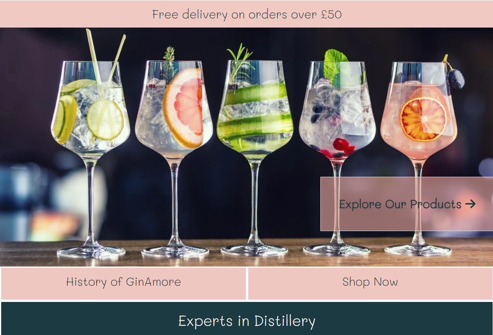

### Popular Gins

Gin products feature on the sites homepage to promote engagement on the site and improving the chances of customers exploring products further. The images where chosen to suit the sophisticated nature of the site and its key colours.

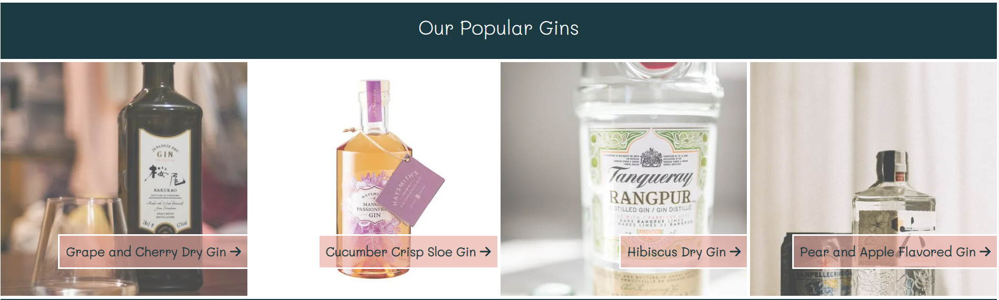

### Our Cocktails

On the sites homepage customers are enticed to explore the sites cocktail recipes through artistic pictures and carefully selected category names. This was done to improve the CTR (Click Through Rate) and the time spent on the site.

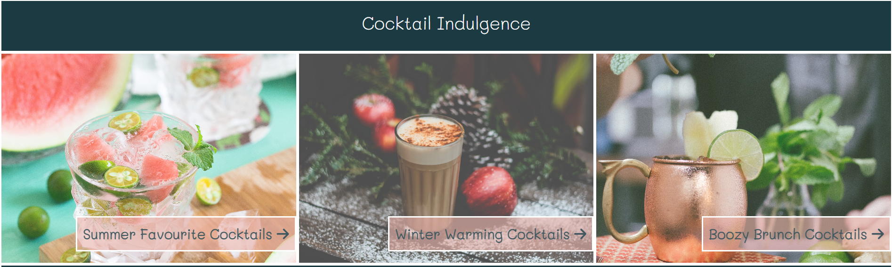

***
## Products
***

### All Products

Users can clearly see all of the products sold at GinAmore. Customers are able to filter products on this page based on cost, rating or category name. Admin users are also able to edit or delete products from the site using clear and distinguishable buttons on the page.

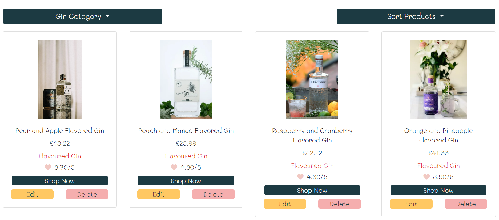

### Product Description

After selecting a product users are directed to the products information this includes name, rating, cost and description. From here they can add products to their shopping bag and alter its quantity.

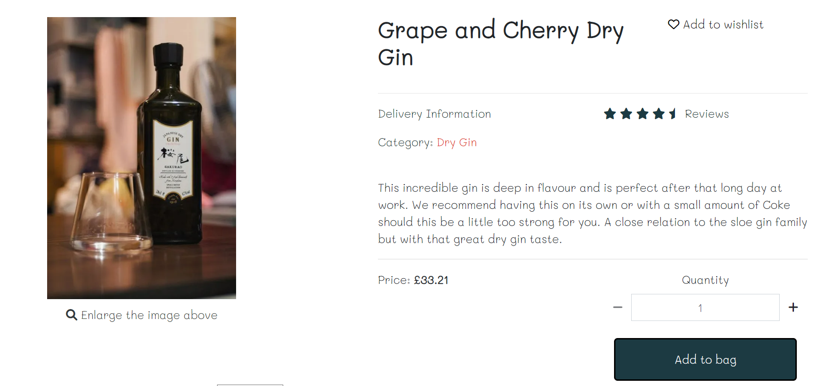

### Delivery and Returns

Within the product detail pages customers are given information about delivery and returns. There is also the option to get more information using the buttons provided, improving the sites google metrics further.

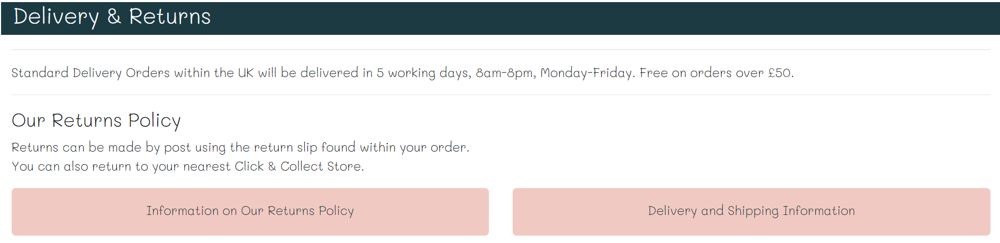

### Recommended Products

Recommended products shown on the product detail pages are based upon the category the user is currently exploring.

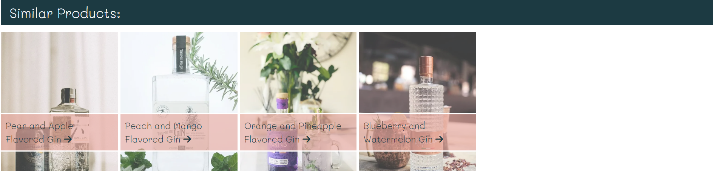

### Reviews

Users are able to review products and cocktail recipes. Admin are able to delete reviews using the cross button seen below.

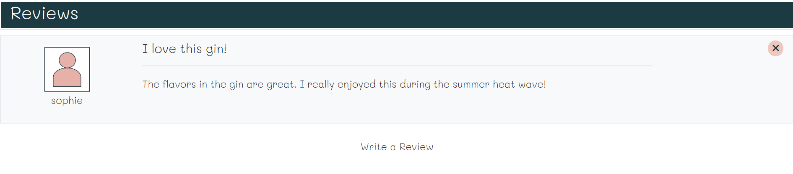

***
## Our Story 
***

A simplistic overview of GinAmore's history is provided to users giving them a feeling of security on the site and making it seem more personal to users.

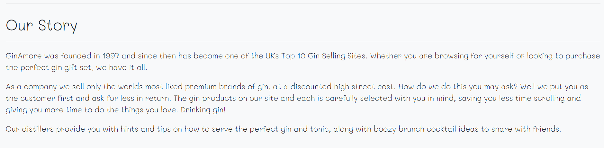

***
## Cocktails
***

### All Cocktails

All cocktail recipes can be seen by users, they are also given the ability to sort products based on their category. Admin are able to edit and delete recipes from this page directly.

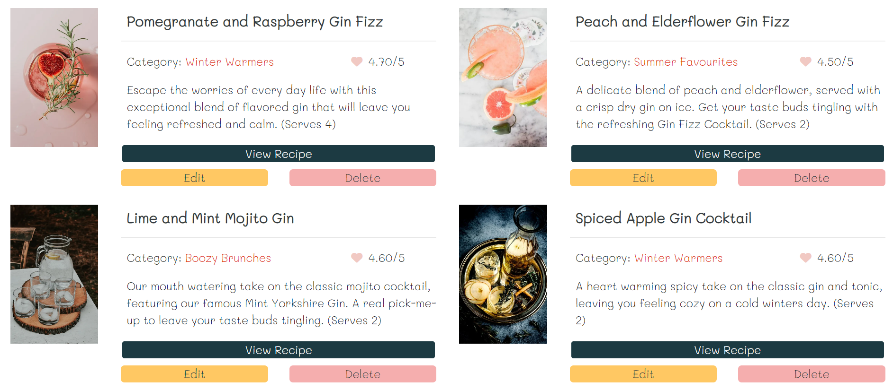

### Cocktail Detail

The cocktail detail page provides users with information about the cocktail including its name, rating, recipe and the ingredients. The information on the page is easy to read and each section is separated improving the readability of content.

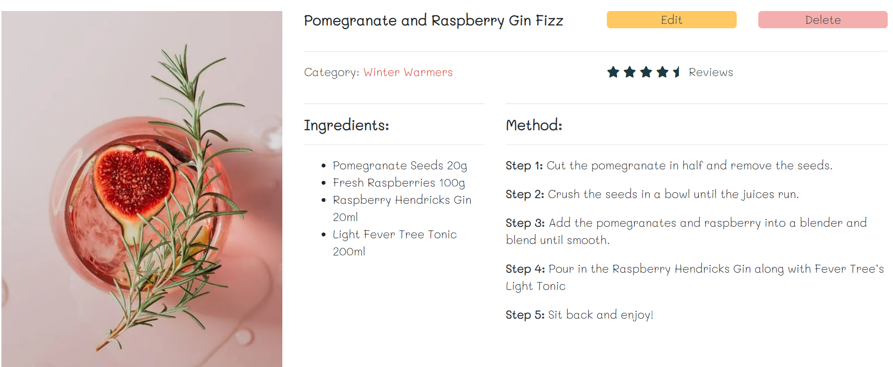

***
## Admin
***

### Add Product

Admin are able to add products on the site using the site admin button at the top of the page. Upon clicking this admin users are given a form containing vital product information as seen below.


### Edit Product

Admin can edit products using the buttons on the product page and product detail pages. The form shown to admin already contains current information saving time when making alterations.

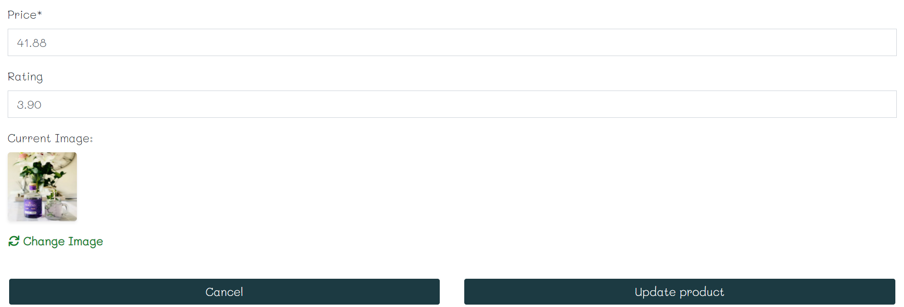

### Add Cocktail

Admin are able to add cocktails on the site using the site admin button at the top of the page. Upon clicking this admin users are given a form containing vital cocktail information as seen below.

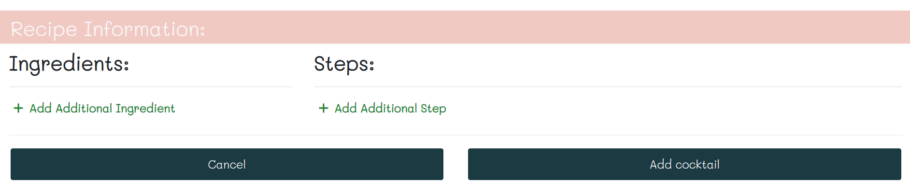

### Edit Cocktail

Admin can edit cocktails using the buttons on the cocktail page and cocktail detail pages. The form shown to admin already contains current information saving time when making alterations.

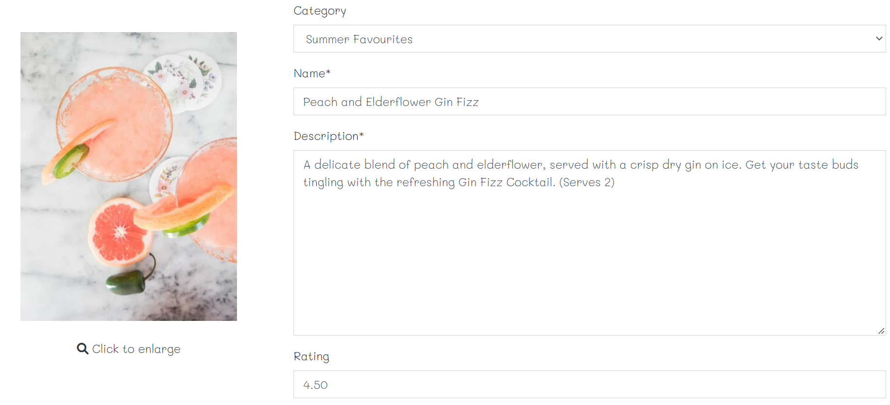

***
## Contact Us
***

A simplistic contact us page is provided with all of the relevant company details

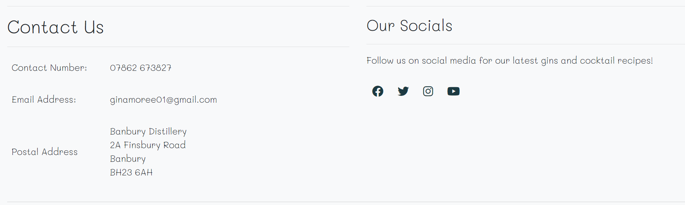

***
## Bag and Checkout
***

### Shopping Bag

Once items have been added to a customers shopping bag they can be seen as shown below. It provides customers with a summary of their order information including the total price, delivery cost, name, quantity and price.

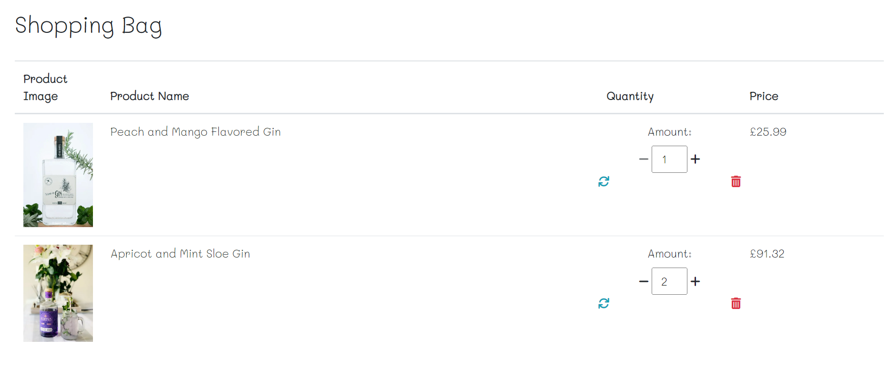

### Checkout

A simplistic checkout form is given for users to complete. If they have already checked out before their and checked that their details should be saved this will be automatically filled in next time. Before confirming and purchasing the items users must confirm they are over the age of 18 using an activate/deactivate button.

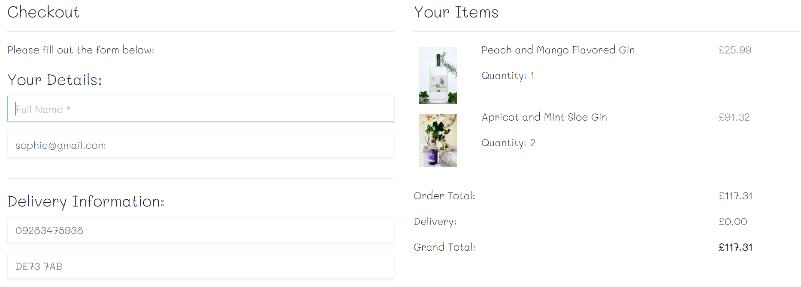

### Checkout Success

Upon successful checkout, customers are shown confirmation of their order on screen containing a breakdown of their information. This will also be sent via email, providing further confirmation and security to the customer.

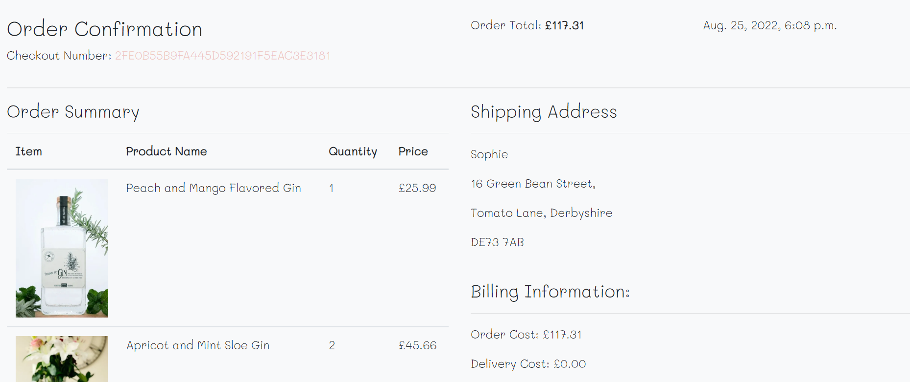

### Previous Orders

Logged in users can see their previous orders within their account section in the navigation bar. They are also able to expand and view each order using the link provided.

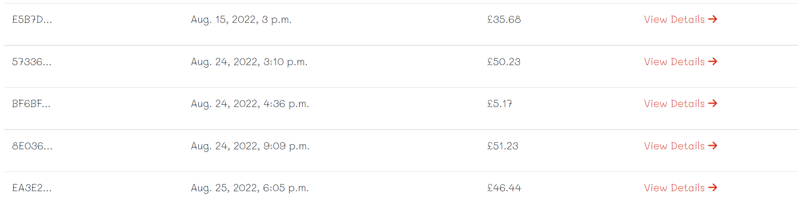

***
## Wishlist
***

Gin products can be added to a customers wish list via the product detail pages. The wish list page allows users to save their favourites for their next visit and purchase them at a later date. They are also given the option to remove the products if they change their mind.

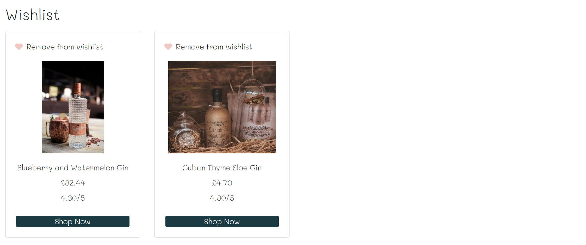

# Future Features

The following features would help improve the site further, given more time I would have liked to have included these elements in my current project:

- Due to time constraints one of the user stories, which allows users to login/register using social media platforms was not completed in this iteration. This user story was allocated as "could have" on the MoSCoW allocation with a story point of 5. Based on the time it would have taken to complete this user story and the little impact it would have had on the users experience on the site other tasks were prioritised. This would be great as a future enhancement to the project.
- Recommended gin products within the cocktail recipe pages of the site, pointing users to mentioned gins and increasing the CTR of the site further, whilst improving sales.
- Extended sorting capabilities of the cocktail recipes to improve UX further and help them find their favourites.
- Improve searching to extend to cocktail recipes not only products.
- A forum area to allowing users to share their own recipes, all with a like function for others to use.
- An interactive star rating on the products and cocktails rather than static images.

# Site Map Wireframe

The following site map was created to help understand the flow of the website prior to development. This helped in understanding the links between pages and ensured pages were easily accessed by users.

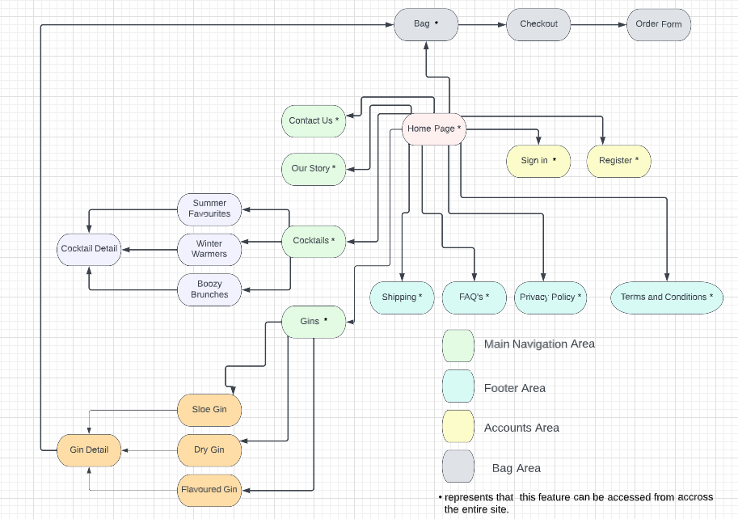

# Database Schema

Entity Relationship Databases (ERD) were created to help develop this project. These were separated into separate database schemas: 'Gin Products' and 'Cocktail Products' due to them not being related to each other directly.

***

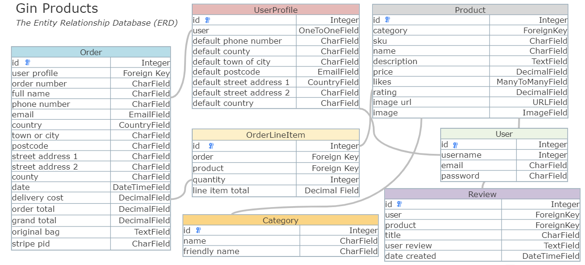

***

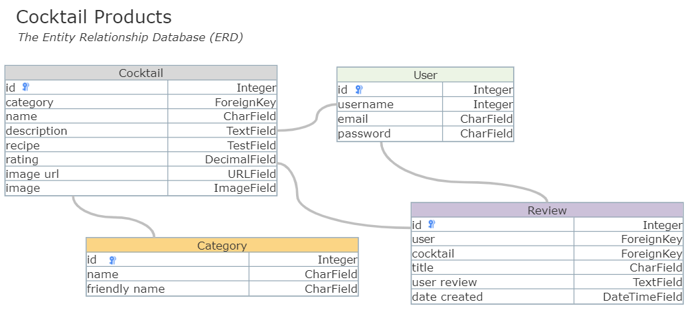

# Marketing

# Search Engine Optimization

The site was optimized by careful selection of keywords. The following steps were taken to do this:

1. The entire table consists of important relevant topics based upon my initial understanding of the business.
2. Using these topics a 'brain dump' of keywords was made orientated around common topics and themes within the business.
3. Topics and keywords were then tried out on Google and the relevant suggestions it gave were added to the keyword list.
2. Words crossed out in red were removed due to too having too much competition using [Wordtracker](https://www.wordtracker.com/?fpr=refer&fp_sid=bingof).
3. Words crossed out in blue were removed due to the lack of relevance and not being specific to the site.

Words in Yellow denote the sites **"Short Tail Keywords"**

Words in Green denote the sites **Long Tail Keywords"**

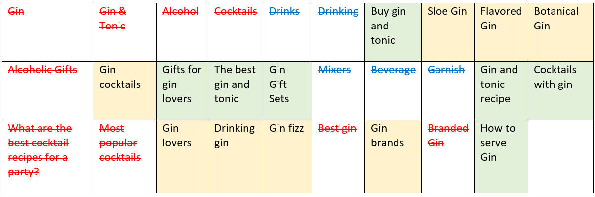

An example of how these words were used throughout the site can be seen below in the screenshot found on the websites homepage:

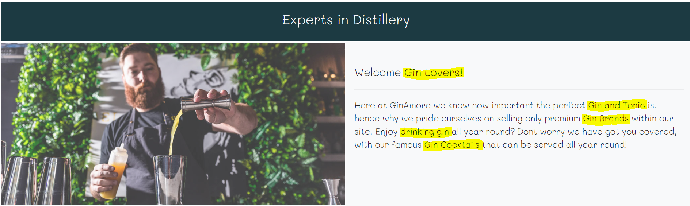

## SEO Implementations in HTML
  - Words/phrases included within semantic HTML elements were optimized using the keywords above.
  - Careful consideration was given to the words chosen to avoid 'keyword stuffing'.
  - Keywords were used within links, urls and aria labels.
  - Social network links include **rel="noopener"** to not affect the assessment of the webpage.
  - Image description alt tags contain the keywords chosen above.
  - External reliable links were included within the site to improve SEO, these include:
    - Charities that the company supports.
    - Recommended mixer brands.
    - Useful tips/advice on drinking sensibly.
  - Within the META data (screenshot)

***
## sitemap.xml
***

A sitemap was made to list the websites important URL's to ensure that search engines are able to easily navigate through the site and understand its structure. This was made using [XML-sitemaps.com](https://www.xml-sitemaps.com/) using the following steps:

1. Paste the URL of the deployed site into XML-sitemaps.
2. Download the XML sitemap file.
3. Drag and drop this files into the projects root folder, and ensure it is labelled **sitemap.xml**

***
## robots.txt
***

A robots.txt file was created to tell search engines where not to allowed go on the site and increase the quality of the site, ultimately improving the SEO rating. The following steps were taken to create this:

1. A file was added named **robots.txt**.
2. The following code was written into this file, adding in your personalised sitemap url:

```
  User-agent: *
  Disallow:
  Sitemap: YOUR_SITEMAP_URL
```

The final steps for working with these two files requires a DNS certificate for a deployed custom domain. This project did not require a custom domain and so has been temporarily left out.

***
## Improving Google Metrics

| Expertise | Authoritativeness | Trustworthiness |
|-----------|-----------------|-----------------|
| Creating engaging content to meet the users needs. | Including clear steps and examples within the recipe section of the site. | Content is professional and avoids typos and spelling mistakes. |
| Included an FAQS page for users. |  | Links to privacy statements and terms and conditions is provided at the bottom. |
| High quality images were included within the site. |  | Reviews are included on all products and cocktails. |

Google metrics were considered when developing the site, including: 

- Click Through Rate (CTR)
  - The title and Meta data of the website were optimized with both short and long tailed keywords.
- Bounce Rate
  - The homepage of the site has been made engaging for the user.
- Dwell Time
  - Content on the homepage is interesting and engaging to users.
- Session Time
  - It is made easy for users to discover more content through 'recommended items" sections on the page.
- Pages Per Session
  - Links were regularly included throughout the website to encourage users to navigate through the website more and engage with more of the content.

# Business Model

The business model used for the GinAmore store would be a B2C (Business to Customer), this is due to the business selling products directly to the customer through the platform. The target market for these products are users:

- Over the age of 18 years old.
- Looking to purchase popular gin brands.

Customers who are buying products from GinAmore should be able to:

- Easily view and purchase gin products from the site.
- Easily navigate and search for products they wish to purchase.
- Be able to subscribe for email discounts and offers.

Alongside this functionality, the user stories for this project document what is required by customers of the site.

# Social Media Platforms

Market research was performed to decide on the marketing strategy needed to promote the GinAmore brand. Based upon other similar sites such as [Edinburgh Gin](https://www.edinburghgin.com/) and [Hendricks Gin](https://www.hendricksgin.com/) all give users access to Facebook, Instagram, Twitter and YouTube from their site. Based on this and the target audience GinAmore aims to appeal for business pages were created for all of these as can be seen below:

## Facebook

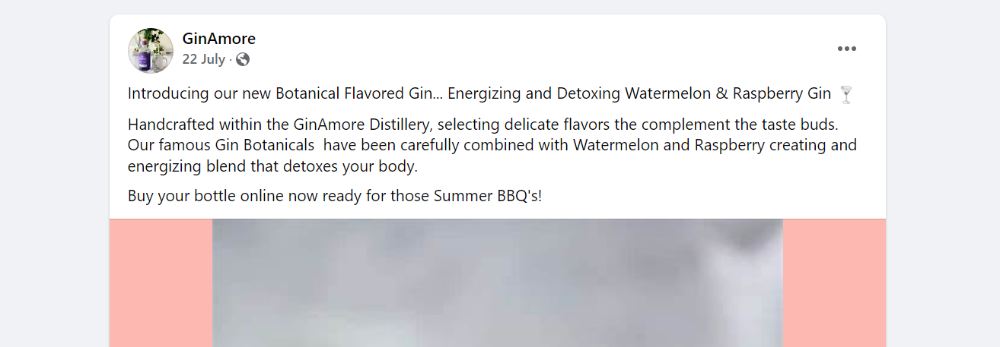

## Instagram


## YouTube

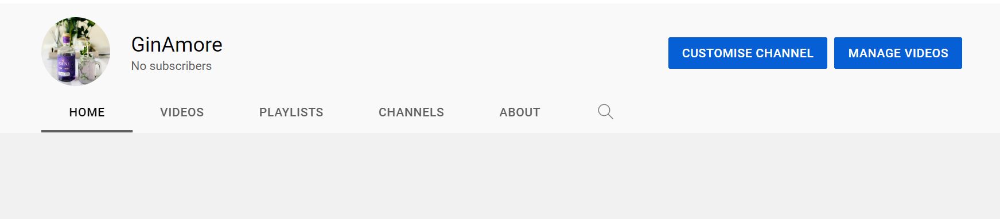

## Twitter

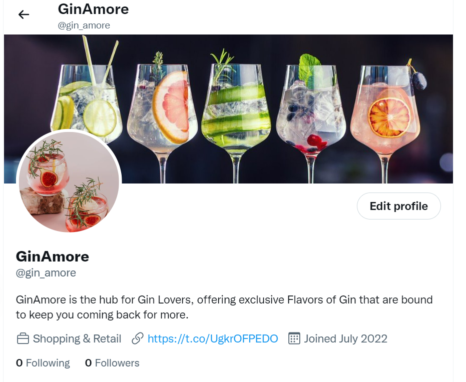

# Mailchimp Email Subscription Service

Users are encouraged to signup for newsletters, discounts and information about the products sold at GinAmore. The email subscription service is ran through [Mailchimp](https://mailchimp.com/en-gb/), allowing shop owners to send marketing emails through the platform, increasing engagement within the site. Below is a screenshot of one of the subscription emails that was sent by GinAmore's shop owner:


# Confirmation Emails

When customers sucessfully purchase a product they are sent an automatic email containing all of their order confirmation details. An image of what this confirmation email looks like can be seen below:

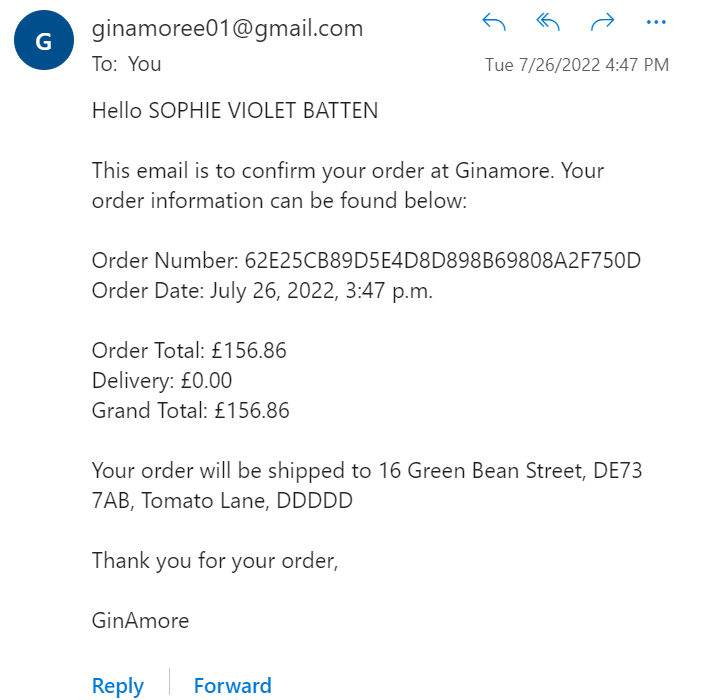

# Colour Scheme

The colours within the site were carefully selected to mirror the premium products sold at GinAmore. The dark regal blue contrasts against the light pink making elements of importance stand out on the page. These colours were initially selected from the sites main banner image using DEV tools, allowing for all colours within the page to compliment each other nicely.

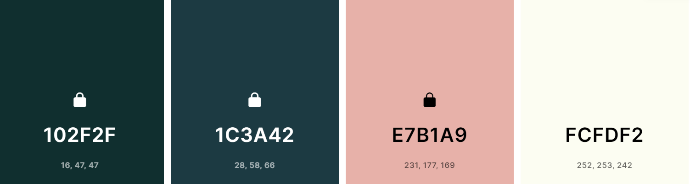

# Typography

The aim of the font was to create a sophisticated feel within the site, complementing the imagery seen throughout. Moreover, text colours were either dark blue or white depending on the background contrast ratio, to ensure information was accessible to users who may be visually impaired. The main font used on the site was 'Mali' and this was selected using [Google Fonts](https://fonts.google.com/).

# Favicon

A simplistic favicon was created in the shape of a gin bottle, using simple lines


# Wireframes

Although the wireframes for site users and site admin are similar there are a few subtle differences between some pages to help admin modify, add and delete products and cocktails. Extra wireframes were created to account for these differences below:

## Desktop Wireframes

***
### Site Users
***

[Homepage](static/images/homepage_desktop.PNG)

[Our Story](static/images/aboutus_desktop.PNG)

[Contact Us](static/images/contact_desktop.PNG)

[Gin Page](static/images/gin_desktop.PNG)

[Gin Detail Page](static/images/gin_detail_desktop.PNG)

[Cocktail Page](static/images/cocktail_desktop.PNG)

[Cocktail Detail Page](static/images/cocktail_detail_desktop.PNG)

[Wishlist](static/images/wishlist_desktop.PNG)

[Shopping Bag](static/images/bag_desktop.PNG)

[Checkout Page](static/images/checkout_desktop.PNG)

[Checkout Success Page](static/images/checkout_success_desktop.PNG)

***
### Site Admin
***

[Gin Page](static/images/gin_admin_desktop.PNG)

[Gin Detail Page](static/images/gin_detail_admin_desktop.PNG)

[Cocktail Page](static/images/cocktails_admin_desktop.PNG)

[Cocktail Detail Page](static/images/cocktail_detail_admin_desktop.PNG)

[Add Product Page](static/images/add_product_desktop.PNG)

[Edit Product Page](static/images/edit_product_desktop.PNG)

## Mobile Wireframes

***
### Site Users
***

[Homepage](static/images/home_mobile.PNG)

[Our Story](static/images/about_us_mobile.PNG)

[Contact Us](static/images/contact_us_mobile.PNG)

[Gin Page](static/images/gin_mobile.PNG)

[Gin Detail Page](static/images/gin_detail_mobile.PNG)

[Cocktail Page](static/images/cocktails_mobile.PNG)

[Cocktail Detail Page](static/images/cocktail_detail_mobile.PNG)

[Wishlist](static/images/wishlist_mobile.PNG)

[Shopping Bag](static/images/bag_mobile.PNG)

[Checkout Page](static/images/checkout_mobile.PNG)

[Checkout Success Page](static/images/checkout_success_mobile.PNG)

***
### Site Admin
***

[Gin Page](static/images/gin_admin_mobile.PNG)

[Gin Detail Page](static/images/gin_detail_admin_mobile.PNG)

[Cocktail Page](static/images/cocktails_admin_mobile.PNG)

[Cocktail Detail Page](static/images/cocktail_detail_admin_mobile.PNG)

[Add Product Page](static/images/add_product_mobile.PNG)

[Edit Product Page](static/images/edit_product_mobile.PNG)

# Technologies Used

***
### Coding Languages
***

* [HTML](https://en.wikipedia.org/wiki/HTML)
  * HTML is the main language used across the site and completes the structure of the webpages.

* [CSS](https://en.wikipedia.org/wiki/CSS)
  * CSS is used throughout to create custom styling to elements across the site.

* [JavaScript](https://en.wikipedia.org/wiki/JavaScript)
  * JavaScript is used within the checkout template to help with form submission and to verify the users age.
  * [jQuery](https://jquery.com/) is used within the following webpages:
    * To update item quantity within the bag template and to update the form.
    * To display success and fail messages within form submission.

* [Python](https://www.python.org/)
  * Python was used extensively on the site to handle back-end functionality.

***
### Frameworks and Platforms
***

* [Django](https://www.djangoproject.com/)
  * The project was created using Django as a framework to help handle back-end functionality. 

* [GitHub](https://github.com/)
  * GitHub was the hosting site for the project code.

* [Gitpod](https://www.gitpod.io/)
  * Gitpod has been used to commit and push code within the GitHub repository.

* [Bootstrap](https://getbootstrap.com/)
  * Bootstrap was used within the site to help format the layout of elements and improve the responsiveness of the site.

* [Google Fonts](https://fonts.google.com/)
  * Google Fonts was used to select the typography type for the website and imported within CSS.

* [AWS S3 Buckets](https://aws.amazon.com/?nc2=h_lg)
  * AWS S3 Buckets provide storage for static and media files within the deployed Heroku site.

* [Heroku](https://www.heroku.com/)
  * Heroku was used as a platform to deploy the site.

* [Google Chrome Developer Tools](https://developer.chrome.com/docs/devtools/)
  * Google Chrome's Developer Tools were used to help debug errors within the code and to help style the site through the colour selector.

* [Uizard Wireframe Generator](https://uizard.io/es/)
  * Wireframes were created and generated through Uizard.

* [Font Awesome](https://fontawesome.com/)
  * Icons used across the site were imported from Font Awesome.

* [Am I Responsive](https://amiresponsive.co.uk/)
  * The site Mock Up image was generated using Am I Responsive.

[Back to top ⇧](#ginamore)

# Testing

## Manual and Automated Testing

### HTML & CSS: W3C Validation

HTML and CSS was checked using an online W3C Validator to ensure there were no errors within the code. 
When the site was ran through the validators there were no errors at the point of deployment.

- [W3C CSS Validator](https://jigsaw.w3.org/css-validator/)
- [WSC HTML Validator](https://validator.w3.org/)

### JavaScript: JSHint

JavaScript code was tested regularly both manually and automatically through [JSHint](https://jshint.com/) and the [DevTools](https://developer.chrome.com/docs/devtools/). DevTools allowed me to test responses using the console log function and JSHint enabled me to ensure that my code was hitting the style guidelines. Upon the launch of my project JSHint showed no errors or warnings with my code.

### Wave Testing: Accessibility

It was important during development that features on the site were made accessible to all users. [WAVE](https://wave.webaim.org/), an accessibility evaluation tool was used to improve this within the site. The tool is specifically aimed at catering for people with disabilities and visual impairments and highlights any problems they could have when using the site. The following actions were taken as a result:

- Alt labels on images were made more descriptive
- Missing labels were added to buttons within the site
- Header elements were ordered within the page
- Links were made darker to improve the contrast ratio

### Lighthouse Reports

A lighthouse report was generated on each page of the site and the following steps were taken to improve sections based on the feedback it provided:
- Performance 
  - Images were converted from jpg files into WebP files using:
  - Images were reduced in size using:
  - Unnecessary script tags were removed from the sites base.html file.
- Accessibility
  - White font colour within the pink banners were changed to blue.
  - Missing labels were added to input form elements.
  - Missing alt tags were added to images.
  - Headers within the site were ordered based upon hierarchy.
- SEO
  - Buttons were increased in size.
- Best Practices

### Automated Testing Reports

Attached below is a screenshot of the HTML & CSS Validator and Lighthouse Reports for each page of the site:

<details>
    <summary>Home Page: Automated Testing Report</summary>
    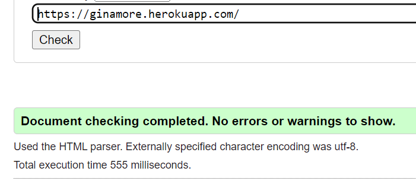
    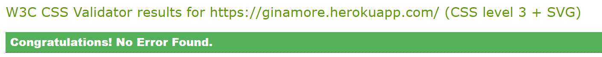
    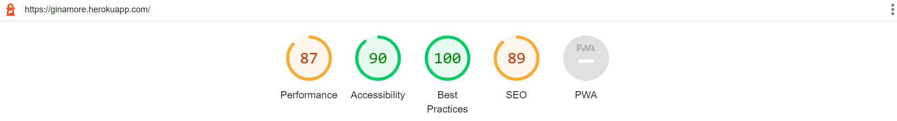
</details>

<details>
    <summary>Products: Automated Testing Report</summary>
    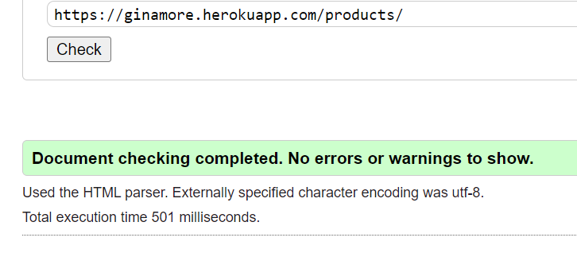
    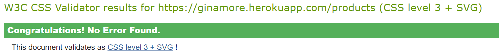
    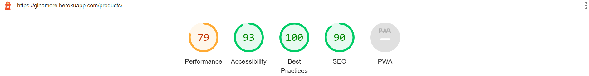
</details>

<details>
    <summary>Product Detail: Automated Testing Report</summary>
    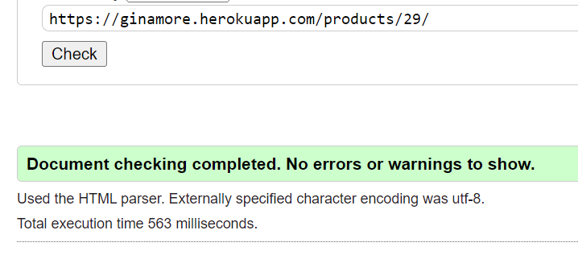
    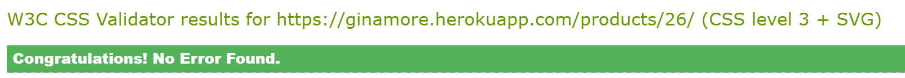
    
</details>

<details>
    <summary>Add Product: Automated Testing Report</summary>
    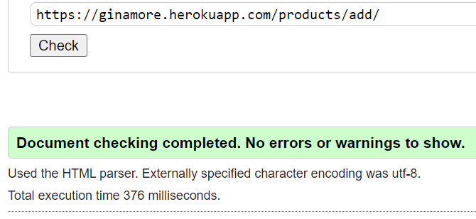
    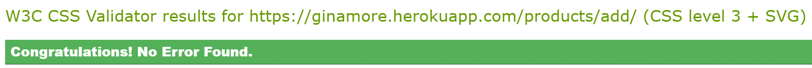
    
</details>

<details>
    <summary>Edit Product: Automated Testing Report</summary>
    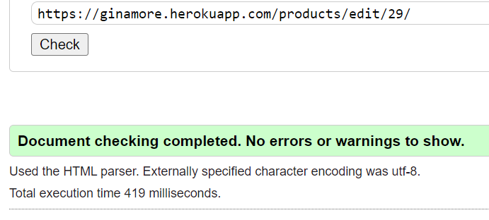
    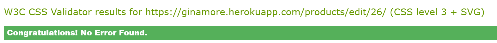
    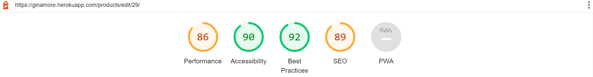
</details>

<details>
    <summary>Cocktails: Automated Testing Report</summary>
    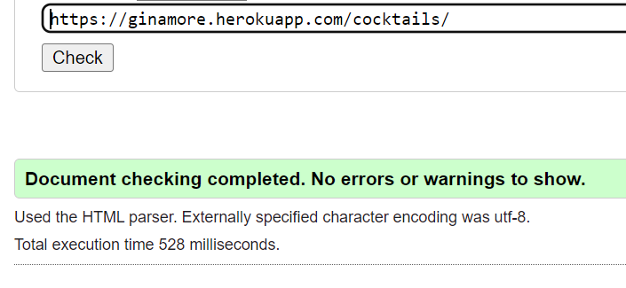
    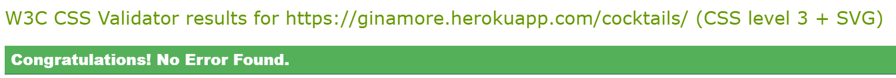
    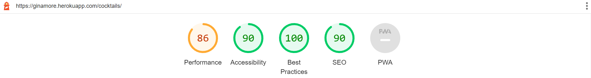
</details>

<details>
    <summary>Cocktail Details: Automated Testing Report</summary>
    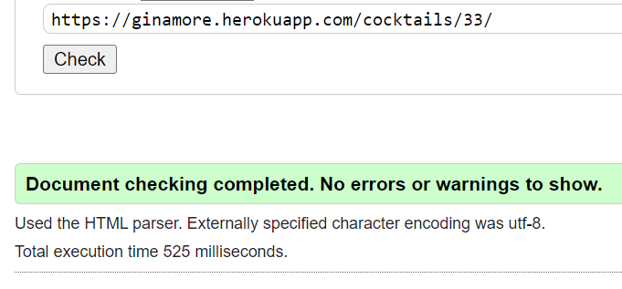
    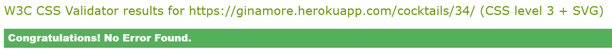
    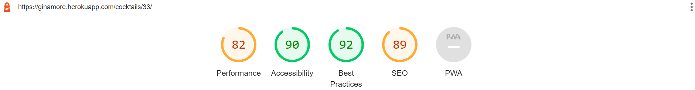
</details>

<details>
    <summary>Add Cocktail: Automated Testing Report</summary>
    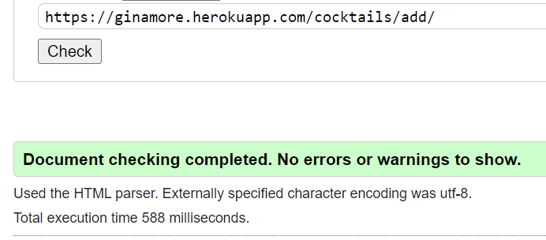
    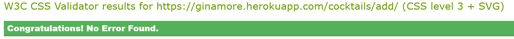
    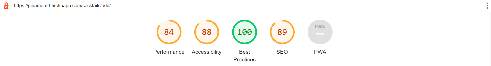
</details>

<details>
    <summary>Edit Cocktail: Automated Testing Report</summary>
    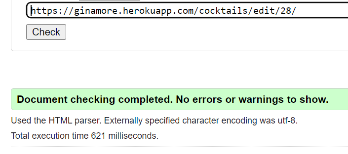
    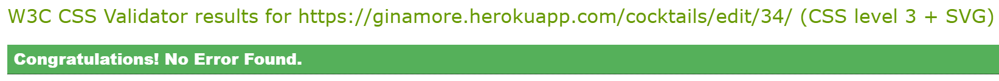
    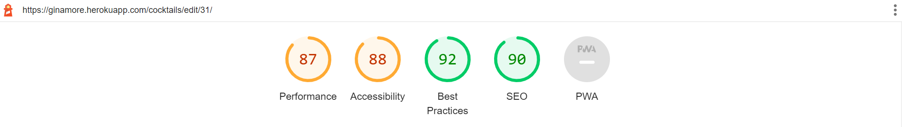
</details>

<details>
    <summary>Our Story: Automated Testing Report</summary>
    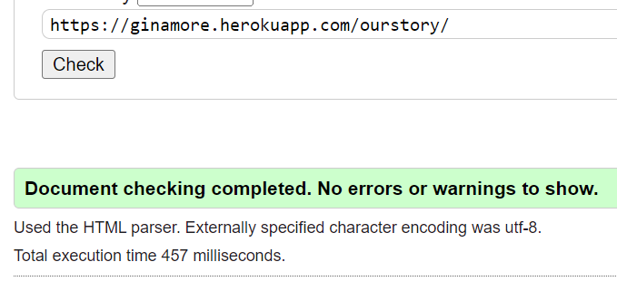
    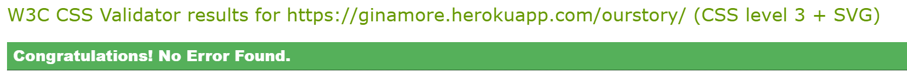
    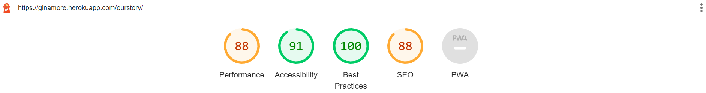
</details>

<details>
    <summary>Contact Us: Automated Testing Report</summary>
    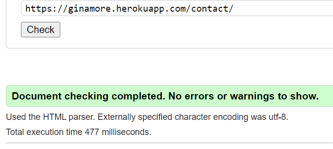
    
    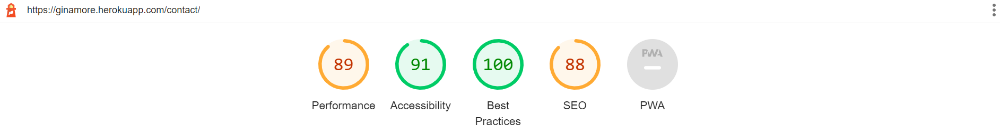
</details>

<details>
    <summary>Wishlist: Automated Testing Report</summary>
    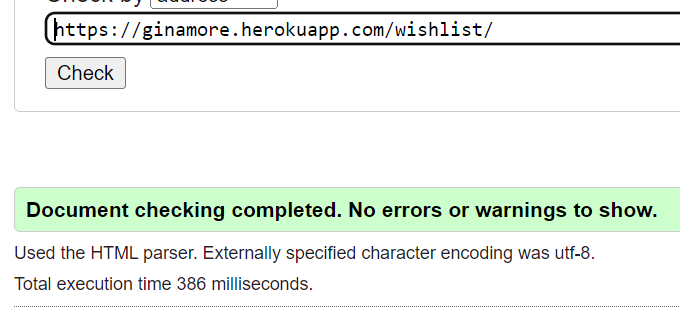
    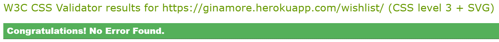
    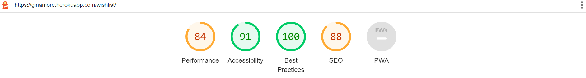
</details>

<details>
    <summary>Profile: Automated Testing Report</summary>
    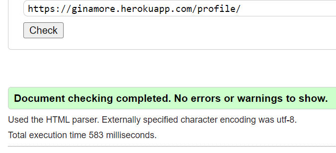
    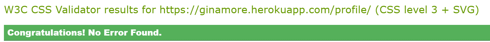
    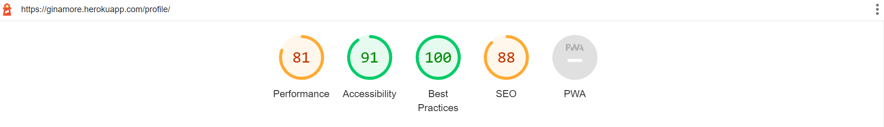
</details>

<details>
    <summary>Bag: Automated Testing Report</summary>
    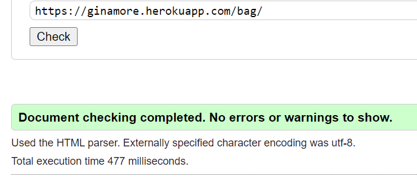
    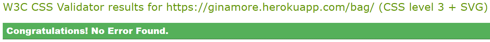
    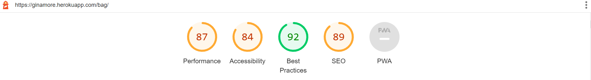
</details>

<details>
    <summary>Checkout: Automated Testing Report</summary>
    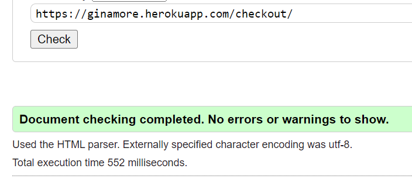
    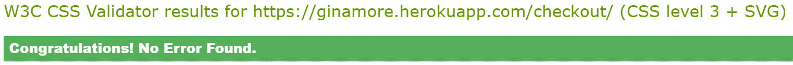
    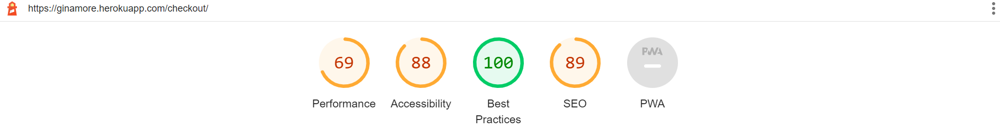
</details>

## Python Testing

### Manual Python Testing

Python code was tested to ensure that it met [PEP8](https://pep8.org/) style guidelines. This was done within the terminal console using the command **python3 -m flake8**, which displayed errors and warnings within the code. All errors that were not a result of autogenerated packages installed from Code Institute's Boutique Ado Walkthrough project were removed upon deployment. The autogenerated warnings are:

  - Linting Issue: Importing checkout.signals in the checkout.apps.py file.
  - Linting Issue: handler 404 error in urls.py file.
  - Linting Issue: Line too long in settings.py file.
  - Linting Issue: Webhook and validator errors with e being assigned but never used.
  - Linting Issue: arctictern.py file as part of Code Institutes template file.

Furthermore, using the MVC framework I was able to keep track of the changes made and ensure that they had the desired output. After each change made to the Postgres Database I referred directly to it to track the changes, ensuring that upon ‘trial runs’ information was being successfully displayed and filters were displaying alongside.

### Automated Python Testing

Some automated python tests were created to check that features of the site were working correctly, details of these tests can be seen below. The tests were ran using the command **python3 manage.py test appname**. Any testing that was not conducted using automated testing was done manually to ensure that site was fully functional upon deployment.

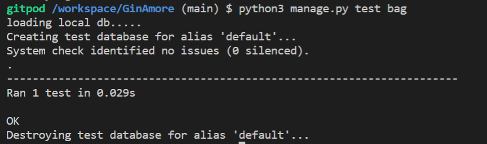
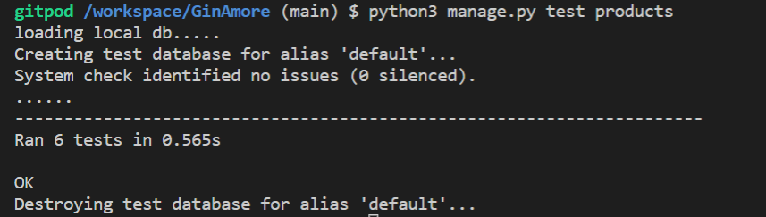
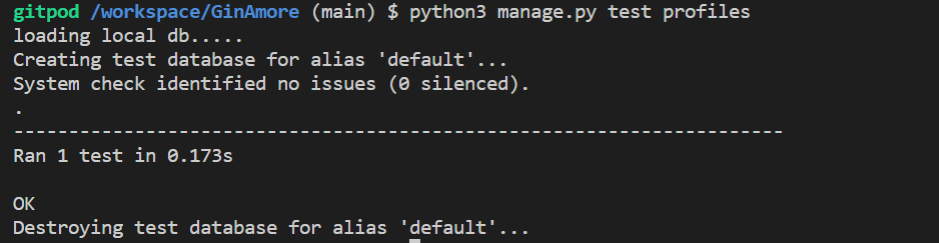

Although not exhaustive the tests ran above test the following functionality on the site:

- Test 1: Ensures the user can view products within their bag through the URL.
- Test 2: Tests a user profile is created when a user registers for an account.
- Test 3: Tests that a user can view all of the products at GinAmore through the URL.
- Test 4: Ensures that users can view individual product detail information through the URL.
- Test 5: Checks that admin can add a product to the website.
- Test 6: Checks that admin can edit a product within the website.
- Test 7: Tests that the product model produces the correct response.

With more time I would have liked to carry out more automated testing on the site, specifically focussing on the cocktail features that were added at a later stage. All other testing was carried out manually and the purpose of this testing was around ensuring that user stories were appropriately met.

# Manual User Story Testing

| ID | I want to be able to...| Manual Testing |
|----|------------------------|----------------|
|1| View a list of all Gin products | A) From all pages of the site the gin drop down menu was tested to ensure it navigated to the all products page. B) The drop down gin menu was also tested from all pages of the site for users and admin when they were logged into their accounts. C) The drop down gin menu was tested on mobile devices to ensure it worked and navigated to the all products page. |
|2| View individual Gin details | A) From the all products page on desktop and mobile each gin product was selected to ensure it displayed the products unique product detail. B) Links shown on the users wish list were tested on mobile and desktop to ensure they navigated to that specific products detail page. C) Our popular gin products shown on the home page were selected to ensure that the links displayed the correct gin product. |
|3| Identify any deals and special offers quickly on the page | A) From all pages of the site the delivery discount can be seen underneath the navigation menu on mobile and desktop screens. B) Items were added to the shopping bag and the delivery information updated to show customers how much more they needed to spend to qualify for discounts. C) Items below the £50 delivery threshold were added to the shopping bag, to test whether users are prompted to spend more in the popup area to qualify for free delivery. |
|4| Easily register for an account | A) [Tempail](https://tempail.com/en/) was used to create a temporary email address used to sign up for an account. B) Upon registering for an account the postgres admin database was checked using super user credentials to see if the new user details appeared and were verified. |
|5| Easily login/logout of my account | A) Registered user details were used on the login page of the site on mobile and desktop to test the login function of the page. B) As a logged in user the logout button was clicked and then confirmed to test the whether users could logout successfully. |
|6| Easily recover my password if I forget it | A) From the login page of the site the forgot password button was clicked and a previous user email address was entered to test whether a reset email was sent. B) The pre-existing user email was logged in successfully using the new password. |
|7| Receive an email to verify I have created an account | A) Upon registering for an account the mail inbox was checked to see whether a confirmation email was sent. |
|8| Register/login to an account via social media | Next iteration. |
|9| Confirm I am of legal age to drink | A) Items were added to the shopping bag and the checkout button selected. I then filled in the checkout details for the user and attempted to click confirm checkout, but the button was disabled until the checkbox to confirm the users age was checked. |
|10| Sort through all Gin products | A) On the all products page, the drop down sort function was tested on mobile and desktop to ensure that products sorted correctly on the screen. |
|11| Sort based on the Gin category | A) On the individual category pages the sort drop down filter was tested on mobile and desktop to ensure products were ordered correctly within the category.|
|12| Search a product by name and description | A) In the search bar product names were entered and searched to ensure they displayed the correct gin products to the user. B) In the search bar the category was entered to ensure they display the correct gin products to the user. |
|13| See search results quickly and easily | A) Upon searching for an item the page was checked to ensure that it displayed the desired results. |
|14| View items in my bag to be purchased | A) Items were added to the users shopping bag and the bag icon at the top of the page was then clicked to ensure it displays all of the relevant item details to the user. B) The bag icon was selected from multiple different pages on the site to ensure that the correct view was shown in each instance. |
|15| Receive an email to verify my order | A) Checkout information was filled in upon adding items to the users shopping bag and the confirm checkout button was clicked. The users mail inbox was the checked to ensure that the correct confirmation details were contained on the users received email. |
|16| View an order confirmation when my order is complete | A) Once checkout information was filled in and confirmed it was tested whether the confirmation screen appeared to users displaying the correct details on the page.|
|17| Securely provide payment details | A) Payment details were added using the temporary card details 4242424242424242 through stripe, within stripe the panel was checked to ensure that the payment was successful and signals were received correctly. |
|18| Enter payment information quickly | A) Checkout details were filled in and the payment section at the bottom of the page took very little time to complete. |
|19| Adjust the quantity of items in my bag | A) Within the shopping bag the quantity buttons were used to alter the amount of product seen within the bag. Upon clicking the refresh button the price information at the bottom of the page was checked to ensure it mirrored this alteration. B) A quantity over 50 was entered and the refresh button clicked to ensure a popup error message appeared to the user saying that the quantity must be below 50. C) The delete button was clicked on the quantity to reduce the quantity to 0 and it was ensured the product no longer appeared in the bag. |
|20| Select the quantity of product to add to shopping bag | A) Within the product detail pages the quantity buttons were used to alter the amount of product selected by the user. Upon adding this to the shopping bag a message appeared with information on the quantity being shown to users. B) A value over 50 was entered to ensure that an error message appeared to users limiting how much product they could buy.  |
|21| Quickly see the total cost of all my products |  A) Upon adding a product to the shopping bag it was tested that a success message appeared to users displaying all of the total cost of all their products. B) On mobile devices it was checked that the total value of all the products could also be seen on a popup message to users. |
|22| Easily Add Cocktail Recipes |  A) As a logged in superuser the add cocktail button was selected and test cocktail details were inputted into each field. The add cocktail button was clicked and it was tested that the cocktail information was mirrored on the screen as a summary. B) Upon adding a cocktail the postgres database was checked to ensure that this had been stored correctly. C) Invalid details were inputted into the add cocktail form to ensure that the user got an error message and details were not saved within the database. |
|23| Edit/Update Cocktail Recipes | A) From both the all cocktails and the cocktail detail page the edit button was clicked to ensure a prefilled edit form appeared to logged in site admin. B) Details were changed on the cocktail form and then saved, these details were then checked on the cocktail detail page. C) Invalid form data was inputted and then the save button was clicked which gave an error message to the admin user.|
|24| Add a Product | A) As a logged in superuser the add product button was selected and test product details were inputted into each field. The add product button was clicked and it was tested that the product information was mirrored on the screen as a summary. B) Upon adding a product the postgres database was checked to ensure that this had been stored correctly. C) Invalid details were inputted into the add product form to ensure that the user got an error message and details were not saved within the database. |
|25| Edit/Update a Product | A) From both the all products and the product detail page the edit button was clicked to ensure a prefilled edit form appeared to logged in site admin. B) Details were changed on the product form and then saved, these details were then checked on the product detail page. C) Invalid form data was inputted and then the save button was clicked which gave an error message to the admin user. |
|26| Delete a Product | A) As a site admin the delete button was clicked and it was then checked that this product no longer appeared on the all product view. B) After deletion of a product it was also checked that this product no longer appeared in the postgres database. |
|27| Rate and Review Cocktail Recipes | A) As a non logged in user it was tested that they were not able to leave a review and encouraged to sign in first. B) As a logged in user it was tested that a review could be left and that the review appeared on the correct product detail view. |
|28| Delete a Review | A) As a site admin it was checked that the user could delete a review and that when the delete button was clicked it no longer appeared on the screen. B) Upon deletion it was checked that a message of confirmed deletion appeared on the screen. |
|29| Leave a Product Review | A) As a non logged in user it was tested that they were not able to leave a review and encouraged to sign in first. B) As a logged in user it was tested that a review could be left and that the review appeared on the correct product detail view. |
|30| Submit cocktail recipe ideas | Not within the scope of the project. MoSCoW marked W. |
|31| Add items to my wish list | A) As a non logged in user it was tested that items could not be added to a wish list and instead users were encouraged to sign in. B) As a logged in user it was tested that upon clicking the add to wish list button the product was added to the users wish list for later viewing. C) It was tested that the wish list could be accessed for many different web pages and that the correct products appeared. |
|32| Remove items from my wish list | A) The remove from wish list button was clicked and it was tested that when clicking this the wish list item no longer appeared on the users wish list. |
|33| View individual cocktail recipes | A) From the all cocktails page on desktop and mobile each cocktail was selected to ensure it displayed the cocktails unique cocktail detail. C) Our cocktails pages shown on the home page were selected to ensure that the links displayed the correct cocktail category. |
|34| View cocktail recipes based on their category | A) Using the filter drop down on the cocktails navigation section of the site it was tested that upon selection of different categories that correct cocktails appeared and were mirrored to the user. |

# Fixed Bugs and Errors

| Bug/Error Identified | Reason for the Error | Fix for the Error |
|-----------|-----------------|-----------------|
| Products on the all products page were all being filtered regardless of the category that was initially selected. | The filter selection option did not have the current category selection included as part of its filtering option. | Within the filtering navigation area the following line of code was added "?category={{ selected_categories }}". |
| When adding the cocktail information as an admin user, initially ingredients were not showing as a list. | Within the cocktail model the ingredients were added as a summernote TextField, which was worked fine when adding the information via the postgres database but didn't work when adding a cocktail as a logged in admin user. | The ingredients section was made into a separate model and connected to the cocktail via a ForeignKey, this was then looped through on the templates page, creating the desired list. |
| When an image wasn't added to the add cocktail page and the form was submitted a Server 500 error appeared to the user. | The image field was not set to required within the database. | The image field was changed to be required ensuring that the user is prompted to add an image each time. |
| When editing a product/cocktail users were initially prompted to remove the image but were not able to change the image at the same time. | The form was requiring there to be no image selected before adding a new one. | The remove function was changed to automatically ask the user to change the image rather than remove it. |

# Deployment

## GitHub
  * Created a new GitHub repository page using the 'Code Institute Template'.
  * Opened the new repository by clicking on the 'Gitpod' button.
  * Installed the relevant apps and packages needed to deploy to HEROKU.

## Django and Heroku

Deployment of my project was scaffolded using the Code Institute's [Django Blog Cheatsheet](https://codeinstitute.s3.amazonaws.com/fst/Django%20Blog%20Cheat%20Sheet%20v1.pdf). Furthermore, the following steps were taken to deploy the project to Heroku from the GitHub repository:

1. Create the Heroku App:
    - Before creating the Heroku app make sure your project has the following files:
        - requirements.txt to create this type the following within the terminal: **pip3 freeze --local > requirements.txt**.
        - Procfile to create this type the following within the terminal: **python run.py > Procfile**.
    - Select "Create new app" within Heroku.
2. Attach the Postgres database:
    - Search "Postgres" within the Resources tab and select the Heroku Postgres option.
3. Create the settings.py file:
    - In Heroku navigate to the Settings tab, click on Reveal Config Vars and copy the DATABASE_URL.
    - Within the Gitpod workspace, create an env.py file within the main directory.
    - Import the env.py file within the settings.py file.
    - Create a SECRET_KEY value within the Reveal Config Vars in Heroku.
    - Add the DATABASE_URL value and your chosen SECRET_KEY value to the env.py file.
    - Run the following command in your terminal **python3 manage.py migrate**.
    - Add the CLOUDINARY_URL to the Reveal Config Vars in Heroku and add this to your settings.py file.
    - Add the following sections to your settings.py file:
        - Cloudinary to the INSTALLED_APPS list
        - STATICFILES_STORAGE
        - STATICFILES_DIRS
        - STATIC_ROOT
        - MEDIA_URL
        - DEFAULT_FILE_STORAGE
        - TEMPLATES_DIR
        - Update DIRS in TEMPLATES with TEMPLATES_DIR
        - Update ALLOWED_HOSTS with ['app_name.heroku.com','localhost']
4. Store Static and Media files in Cloudinary and Deploy to Heroku:
    - Create three directories in the top level directory: media, storage and templates.
    - Create a file named "Procfile" in the main directory and ass the following: [web: gunicorn project-name.wsgi].
    - Login to Heroku within the terminal window using **heroku login -i**
    - Run the following command in the terminal window: **heroku git:remote -a your_app_name_here**. By doing this you will link the app to your GidPod terminal.
    - After linking the app you can deploy new versions to Heroku by running the command **git push heroku main**.
  
[Back to top ⇧](#ginamore)

***
### Allauth

Within the Django Framework, Allauth a package that handles registration and login details was installed. More information on how this was installed can be found here: [Django Allauth Installation](https://django-allauth.readthedocs.io/en/latest/installation.html).
****

## Forking the Repository

  * Log in to GitHub and locate the required GitHub repository.
  * At the top of the Repository, above the **"Settings"** button, locate the button labelled **"Fork"**.
  * You should now have a copy of the original repository within your GitHub account.
  * You can make changes to this new version whilst keeping the original version safe.

## Cloning the Repository

  * Ensure that you are logged into GitHub and locate the required GitHub repository.
  * Click the dropdown button labelled **'Code'** above the file list.
  * Copy the URL for the required repository.
  * Open Git Bash on your device.
  * Change the current working directory to the location where you want the cloned directory.
  * Type git clone in the CLI and then paste the URL you copied earlier. This is what it should look like: $ git clone https://github.com/sophiebatten123/ginamore
  * Press Enter to create your local clone.

  For more information on how to clone a repository read GitHub's [Cloning a Repository](https://docs.github.com/en/repositories/creating-and-managing-repositories/cloning-a-repository) document.

[Back to top ⇧](#ginamore)

# AWS S3 Bucket Set Up

The deployed site uses AWS S3 Buckets to store the webpages static and media files. More information on how you can set up an AWS S3 Bucket can be found below:

1. Create an AWS account [here](https://portal.aws.amazon.com/billing/signup#/start/email).
2. Login to your account and within the search bar type in **S3**.
3. Within the S3 page click on the button that says **Create Bucket**.
4. Name the bucket and select the region which is closest to you.
5. Underneath **Object Ownership** select **ACLs enabled**.
6. Uncheck **Block Public Access** and acknowledge that the bucket will be made public, then click **Create Bucket**.
7. Inside the created bucket click on the **Properties** tab. Below **Static Website Hosting** click **Edit** and change the Static website hosting option to **Enabled**. Copy the default values for the index and error documents and click **Save Changes**.
8. Click on the **Permissions** tab, below **Cross-origin Resource Sharing (CORS)**, click **Edit** and then paste in the following code:

  ```
    [
        {
            "AllowedHeaders": [
            "Authorization"
            ],
            "AllowedMethods": [
            "GET"
            ],
            "AllowedOrigins": [
            "*"
            ],
            "ExposeHeaders": []
        }
    ]
  ```

9. Within the **Bucket Policy** section. Click **Edit** and then **Policy Generator**. Click the **Select Type of Policy** dropdown and select **S3 Bucket Policy** and within **Principle** allow all principals by typing *.
10. Within the **Actions** dropdown menu select **Get Object** and in the previous tab copy the **Bucket ARN number**. Paste this within the policy generator within the field labelled **Amazon Resource Name (ARN)**.
11. Click **Add statement > Generate Policy** and copy the policy that's been generated and paste this into the **Bucket Policy Editor**.
12. Before saving, add /* at the end of your **Resource Key**, this will allow access to all resources within the bucket.
13. Once saved, scroll down to the **Access Control List (ACL)** and click **Edit**.
14. Next to **Everyone (public access)**, check the **list** checkbox and save your changes.

[Back to top ⇧](#ginamore)

# IAM

1. Search for IAM within the AWS navigation bar and select it.
2. Click **User Groups** that can be seen in the side bar and then click **Create group** and name the group 'manage-your-project-name'.
3. Click **Policies** and then **Create policy**.
4. Navigate to the JSON tab and click **Import Managed Policy**, within here search **S3** and select **AmazonS3FullAccess** followed by **Import**.
5. Navigate back to the recently created S3 bucket and copy your **ARN Number**. Go back to **This Policy** and update the **Resource Key** to include your ARN Number, and another line with your ARN followed by a /*. Below is an example of what this should look like:

```
{
    "Version": "2012-10-17",
    "Statement": [
        {
            "Effect": "Allow",
            "Action": [
                "s3:*",
                "s3-object-lambda:*"
            ],
            "Resource": [
                "YOUR-ARN-NO-HERE",
                "YOUR-ARN-NO-HERE/*"
            ]
        }
    ]
}

```

6. Ensure the policy has been given a name and a short description, then click **Create Policy**.
7. Click **User groups**, and then the group you created earlier. Under permissions click **Add Permission** and from the dropdown click **Attach Policies**.
8. Select **Users** from the sidebar and click **Add User**.
9. Provide a username and check **Programmatic Access**, then click 'Next: Permissions'.
10. Ensure your policy is selected and navigate through until you click **Add User**.
11. Download the **CSV file**, which contains the user's access key and secret access key.

[Back to top ⇧](#ginamore)

# Connecting AWS to Django

1. Within your terminal install the following packages by typing 

```
  pip3 install boto3
  pip3 install django-storages 
```  

2. Freeze the requirements by typing 

```
pip3 freeze > requirements.txt
```

3. Add **storages** to your installed apps within your settings.py file.
4. At the bottom of the settings.py file add the following code:

```
if 'USE_AWS' in os.environ:
    AWS_STORAGE_BUCKET_NAME = 'insert-your-bucket-name-here'
    AWS_S3_REGION_NAME = 'insert-your-region-here'
    AWS_ACCESS_KEY_ID = os.environ.get('AWS_ACCESS_KEY_ID')
    AWS_SECRET_ACCESS_KEY = os.environ.get('AWS_SECRET_ACCESS_KEY')
```
5. Add the following keys within Heroku: **AWS_ACCESS_KEY_ID** and **AWS_SECRET_ACCESS_KEY**. These can be found in your CSV file.
6. Add the key **USE_AWS**, and set the value to True within Heroku.
6. Remove the **DISABLE_COLLECTSTAIC** variable from Heroku.
7. Within your settings.py file inside the code just written add: 

```
  AWS_S3_CUSTOM_DOMAIN = f'{AWS_STORAGE_BUCKET_NAME}.s3.amazonaws.com'
```
8. Inside the settings.py file inside the bucket config if statement add the following lines of code:

```
STATICFILES_STORAGE = 'custom_storages.StaticStorage'
STATICFILES_LOCATION = 'static'
DEFAULT_FILE_STORAGE = 'custom_storages.MediaStorage'
MEDIAFILES_LOCATION = 'media'

STATIC_URL = f'https://{AWS_S3_CUSTOM_DOMAIN}/{STATICFILES_LOCATION}/'
MEDIA_URL = f'https://{AWS_S3_CUSTOM_DOMAIN}/{MEDIAFILES_LOCATION}/'

AWS_S3_OBJECT_PARAMETERS = {
    'Expires': 'Thu, 31 Dec 2099 20:00:00 GMT',
    'CacheControl': 'max-age=94608000',
}
```

9. In the root directory of your project create a file called **custom_storages.py**. Import the following at the top of this file and add the classes below:

```
  from django.conf import settings
  from storages.backends.s3boto3 import S3Boto3Storage

  class StaticStorage(S3Boto3Storage):
    location = settings.STATICFILES_LOCATION

  class MediaStorage(S3Boto3Storage):
    location = settings.MEDIAFILES_LOCATION
```

10. Navigate back to you AWS S3 Bucket and click on **Create Folder** name this folder **media**, within the media file click **Upload > Add Files** and select the images for your site.
11. Under **Permissions** select the option **Grant public-read access** and click **Upload**.

[Back to top ⇧](#ginamore)

# Stripe Payments

To handle payments within the website ensure that you have set this up a guide on how this can be done can be found [here](https://stripe.com/docs/payments/accept-a-payment#web-collect-card-details).

# Credits

- The images used on my site were taken from [Shutterstock](https://www.shutterstock.com/) and  [Pexels](https://www.pexels.com/).
- The icons included throughout the website were taken from [Font-Awesome](https://fontawesome.com/).
- The [Coding Entrepreneurs](https://www.youtube.com/c/CodingEntrepreneurs) tutorial videos were used to help with building the cocktail ingredient section of my site helping me to further understand the relationship between different models.
- The colour theme was chosen using [coolors](https://coolors.co/).
- Help and support was given by the Code Institute Tutors.

Thank you to all those who have supported me in my journey this year! A special shout out to my partner for always being there and pushing me to keep going when things got tough. Also to the incredible tutors at Code Institute who helped me when I got stuck.